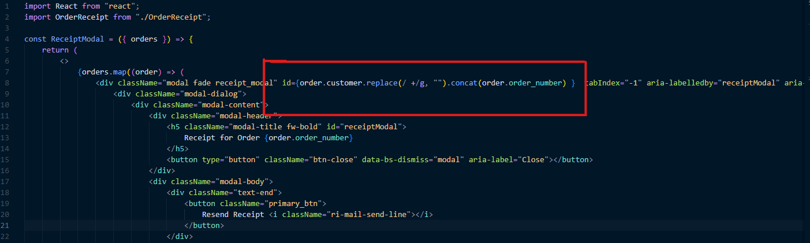
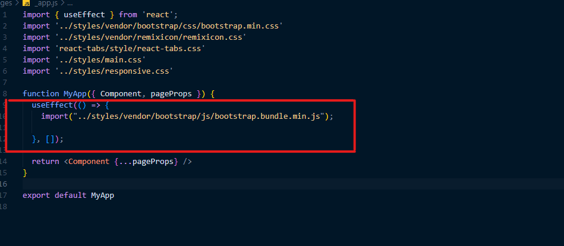

## Introduction
DPS Resto is a simple react nextjs  template for a restaurant. It is designed with only the necessary components and pages that are needed for the real world scenarios. The data, email addresses ,domain names and physical addresses  used in this template are fictitious and are intended for simulation purposes only. 

## Installation
- ### Prerequisites
1. Nodejs v16.13+ (Recommended Version: any version greater or equal to 14.16+). 
2. NPM (This comes along with Nodejs that is installed on your machine)

- ### Dependencies
```
  "dependencies": {
    "next": "12.2.1",
    "react": "18.2.0",
    "react-dom": "18.2.0",
    "react-tabs": "^5.1.0",
    "recharts": "^2.1.12",
    "sass": "^1.53.0",
    "sharp": "^0.30.7",
    "sweetalert2": "^11.4.23",
    "sweetalert2-react-content": "^5.0.1"
  },

```
- ### Running on Development Environment
Extract the zip folder to a location of your choice on your local machine. Open the project folder, `dpsresto` ,with a code editor of your choice.
Use the terminal to navigate to the project root.

Then run: `npm install` or `yarn add` .

Then run : `npm run dev` or `yarn dev`.

In the browser go to  http://localhost:3000 and your app should be running.

- ### Styling
This template was build using Sass for styling. You may watch this https://www.youtube.com/watch?v=_a5j7KoflTs if you are new to Sass.

If you dont like using Sass, you can alter the styling in main.css and responsive.css files.

### Build Production
Run : `npm run build` or `yarn build`

Then Run : `npm run start` or `yarn start`


## Template Features
- Reactjs 18+
- Nextjs 12+
- Bootstrap v5.x
- Nextjs page-based routing
- Sass
- Remixicon Icons

## Pages 

   ### User Interface
- Home page .................. pages/index.js
- Menu page .................. pages/menu.js
- Cart page .................. pages/cart.js
- Track Order page .................. pages/track-order.js
- Contact page .................. pages/contact-us.js
- Login page .................. pages/login.js
- Sign Up page .................. pages/signup.js
- My Account page .................. pages/my-account.js
- Reset Password .................. pages/password-reset.js
- Privacy Policy .................. pages/privacy-policy
- Terms of Service .................. pages/terms-of-service

   ### Admin Interface
- Dashboard .................. pages/admin/index.js
- Customers .................. pages/admin/customers.js
- Menus .................. pages/admin/menus.js
- Orders .................. pages/admin/orders.js
- Notifications .................. pages/admin/notifications.js

## Components
  ### Main App Components
- NavBar .................. components/Navbar.js
- SideBar .................. components/SideBar.js
- Footer .................. components/Footer.js
- Hero .................. components/Hero.js
- CartItem .................. components/CartItem.js
- ChangeAddressModal .................. components/ChangeAddressModal.js
- ContactForm .................. components/ContactForm.js
- ContactInfo .................. components/ContactInfo.js
- CTA .................. components/CTA.js
- EnterAddress .................. components/EnterAddress.js
- Filters .................. components/Filters.js
- Pagination .................. components/Pagination.js
- Search .................. components/Search.js
- TabContent .................. components/TabContent.js

### Dashboard Components
- AddButton .................. components/Dashboard/AddButton.js
- AddMenuModal .................. components/Dashboard/AddMenuModal.js


## Hacks
1. Added ``data-bs-dismiss="modal"`` on SideBar Modal Sign Up & Login Buttons for removing the backdrop of the modal when you navigate to other pages. 

2. Adding a distinct name and/or unique id to make sure that the correct modal of a specific item is selected.



3. Import the bootstrap.bundle.min.js inside a useEffect in  `_app.js` to take advantage of Bootstrap's modals and dropdowns.



## Acknowledgements
- Images adapted from https://pixabay.com/, www.freepik.com
- Image icons adapted from https://icons8.com/icons
- Privacy Policy Generated using GetTerms.io
- Terms of Service were created for dpsresto.com by PolicyMaker.io

## Support 
If you need assistance with this template, kindly send me an email on  [mawondep@gmail.com].